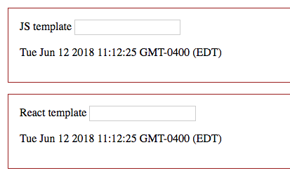
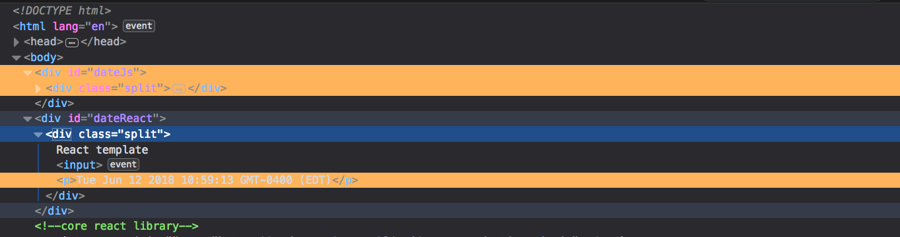
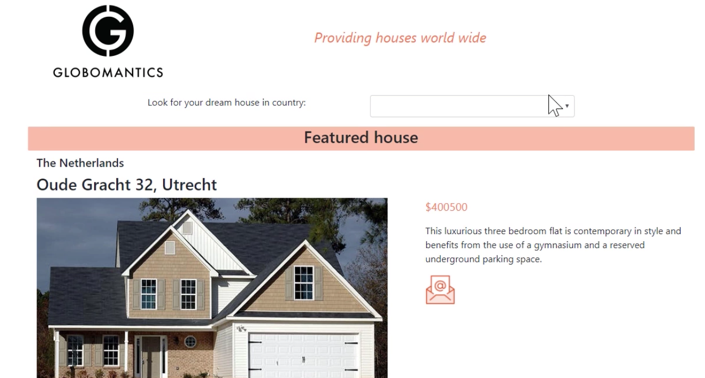
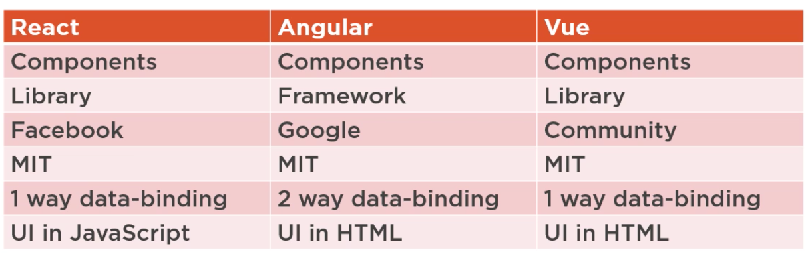
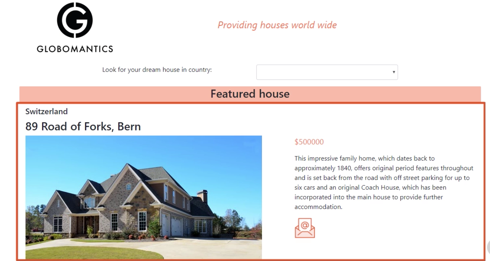
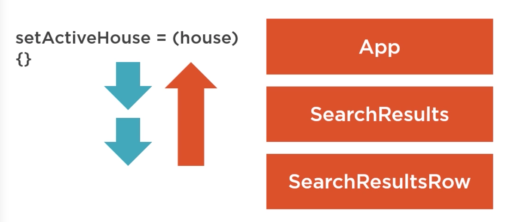

<!-- START doctoc generated TOC please keep comment here to allow auto update -->
<!-- DON'T EDIT THIS SECTION, INSTEAD RE-RUN doctoc TO UPDATE -->
**Table of Contents**  *generated with [DocToc](https://github.com/thlorenz/doctoc)*

- [A Practical Start with React](#a-practical-start-with-react)
  - [Should You React?](#should-you-react)
    - [Smart DOM Updates](#smart-dom-updates)
    - [The React Element Tree](#the-react-element-tree)
    - [Separation of Concerns](#separation-of-concerns)
    - [Tree Reconciliation](#tree-reconciliation)
    - [JSX](#jsx)
    - [The React UI Workflow](#the-react-ui-workflow)
    - [Components](#components)
    - [Alternatives to React](#alternatives-to-react)
  - [Getting Ready](#getting-ready)
    - [Production Mode](#production-mode)
    - [VS Code](#vs-code)
  - [Structuring the Application](#structuring-the-application)
    - [The Public Folder](#the-public-folder)
    - [The src Folder](#the-src-folder)
    - [React's Entry Point](#reacts-entry-point)
    - [Modules](#modules)
    - [The Top-level Component](#the-top-level-component)
    - [Importing External Modules](#importing-external-modules)
    - [Placing Components in Folders](#placing-components-in-folders)
  - [Understanding Components](#understanding-components)
    - [Creating a Simple Component](#creating-a-simple-component)
    - [Class and Function Components](#class-and-function-components)
    - [Props](#props)
    - [Fetching Data](#fetching-data)
    - [State](#state)
      - [State Updates](#state-updates)
    - [Lifecycle Methods](#lifecycle-methods)
      - [Lifecycle Methods: Mouting](#lifecycle-methods-mouting)
      - [Lifecycle Methods: Updating](#lifecycle-methods-updating)
      - [Lifecycle Methods: Unmouting](#lifecycle-methods-unmouting)
      - [Lifecycle Methods: Error Boundary](#lifecycle-methods-error-boundary)
    - [Error Boundaries](#error-boundaries)
    - [Nesting Components](#nesting-components)
    - [Binding Component Props](#binding-component-props)
    - [Mapping Arrays to Components](#mapping-arrays-to-components)
    - [Passing Functions to Child Components](#passing-functions-to-child-components)
    - [Components in Variables](#components-in-variables)
    - [Multiple Layers of Components](#multiple-layers-of-components)
    - [Varying Render Output with Component Variables](#varying-render-output-with-component-variables)
    - [Form Controls](#form-controls)

<!-- END doctoc generated TOC please keep comment here to allow auto update -->

# A Practical Start with React

> My notes from [this Pluralsight course](https://app.pluralsight.com/library/courses/react-practical-start/table-of-contents).

## Should You React?

### Smart DOM Updates

[Markup](smart-dom-updates/index.html) | [Script](smart-dom-updates/script.js)

Comparing plain js and react for updating DOM.

The react method of creating a DOM element and rendering it looks more complicated than the plain js version, however, notice the DOM updates - plain js version is updating the entire div whereas react version only updates what's changing (the date in this example), even though the code tells react to update the entire div. This makes it impossible to type in text in the plain version, but can do in react:





### The React Element Tree

React does not use HTML directly, rather it uses a tree of JavaScript objects to define UI, where each is created via `React.createElement`:

```html
<div class="split">
  <input />
  <p>Sunday 4:00pm</p>
</div>
```

```javascript
Rreact.createElement(
  'div',
  { className: 'split' },
  React.createElement('input'),
  React.createElement(
    'p',
    null,
    'Sunday 4:00pm'
  )
);
```

The tree is used to create HTML for browser. This means UI is written in js instead of html...

### Separation of Concerns

react-dom library (containing everything needed for browser support, including object tree transformation) is intentionally separate from core react engine. Benefit is open ended, eg: react-native renders an object tree to mobile controls for different mobile platforms.

Object tree is not the UI, it's instructions for how UI should be rendered. React passes tree to DOM library for rendering.

Philosophy: What's displayed in the browser is a reflection of the state of the application.

### Tree Reconciliation

In simple demo, object tree changes every second due to date change, eg:

```javascript
React.createElement(
  'div',
  { className: 'split' },
  React.createElement('input'),
  React.createElement(
    'p',
    null,
    'Sunday 4:01pm' // only this changed
  )
);
```

Every time a change occurs, a new object tree is created, but old one is kept. React compares the new to old object trees and only redraws elements where a change was detected. In above example, its the `<p>` element containing the date string. Then the old tree is disposed of.

However, creating every DOM element with `createElement` API is tedious, this is where JSX comes in.

### JSX

Seems like HTML but is actually js. Notice `className` instead of `class` for css:

```jsx
<div className="split">
  <input />
  <p>
    Sunday 4:01 pm
  </p>
</div>
```

JSX syntax is translated to `React.createElement(...)` syntax by Babel.

### The React UI Workflow

- Write JSX to define UI
- JSX translated to JS with React.createElement statements using Babel
- Each time app needs to be renderd to browser, react-dom uses react elements to generate actual DOM, but only updated elements are rendered.


### Components

Philosophy: React is a JavaScript library to create and compose components.

Each component has the following:

1. A name.
1. Accepts inputs from other components using `props`. In jsx, these are written as html attributes.
1. Can maintain an internal `state`.
1. Knows how to render itself by calling `render()` function. This process may involve other components.

App will be building in this course - note components such as header, search, featured house:



**Composition**

React app is a composition of components. Typically top level component is named `app`. App renders other components, eg: Header, FeaturedHouse, SearchResults. Each component can further render other components, eg: FeaturedHouse will render HouseDetail.


Each component maintains its own internal state, and can pass input to its child components using `props`.

### Alternatives to React

Angular and Vue are most popular other choices. All are good products, choice depends on personal preference or that of your team.

If don't like the fact that UI is written in JS, and prefer to write in separate html file, consider Angular.



Note: Writing HTML in JS may feel strange at first, but Angular and Vue write JS expressions in HTML which is also weird, and more difficult to debug.

## Getting Ready

Will be using [create-react-app](https://github.com/facebook/create-react-app) for scaffolding.

- Install latest LTS Node
- `npx create-react-app globomantics`, output:

```shell
Success! Created globomantics at /path/to/globomantics
Inside that directory, you can run several commands:

  npm start
    Starts the development server.

  npm run build
    Bundles the app into static files for production.

  npm test
    Starts the test runner.

  npm run eject
    Removes this tool and copies build dependencies, configuration files
    and scripts into the app directory. If you do this, you can’t go back!
```

- `cd globomantics`
- `BROWSER="Firefox Developer Edition" npm start` (or just `npm start` to use default Chrome)

create-react-app installs tools needed for development. Especially important:

- webpack: smart bundler to package components that are in modules within the app
- babel: transpiles jsx into javascript, also transpiles ES2015+ to ES5

### Production Mode

`npm run build` generates an optimized build in `build` dir.

### VS Code

Good support for React. Install a few extensions:

- Debugger for Chrome
- Simple React Snippets

Use View -> Integrated Terminal, then can run `npm start` from within VS Code terminal rather than switching to a separate terminal app.

To setup debugging:
- Click debug button in sidebar
- Click run icon (green caret)
- Select `Chrome` environment
- Opens `launch.json` - config file for vs code
- Change port from `8080` to `3000` (port used by create-react-app dev server) and save
- Click run icon again, this time, a separate instance of Chrome is launched
- Open App.js and set a breakpoint in render function
- Refresh browser (Chrome instance launched by VS Code)
- This will hit breakpoint
- Can also set breakpoints on JSX lines such as `<header...>`
- Press stop button from debug controls -> didn't work for me, browser went away
- Make some change to App.js such as changing a text value -> browser will update to reflect the change -> didn't work for me, browser went away

Can also turn on File -> Autosave in VS Code to avoid having to manually save file changes.

Also install [React dev tools for chrome](https://chrome.google.com/webstore/detail/react-developer-tools/fmkadmapgofadopljbjfkapdkoienihi/related)

New React tab in dev tools shows JSX, can click on components to inspect props and state of component.

## Structuring the Application

### The Public Folder

Files in `public` dir are NOT processed by Webpack, they are just copied there untouched such as favicon.ico and manifest.json.

[public/index.html](public/index.html) is a template. It has `%PUBLIC_URL%` which is replaced with public url when build is run.

`index.html` can only reference files in public folder. Notice there are no js files referenced.

### The src Folder

This contains js and css files, and also logo.svg. All files in `src` dir are processed by Webpack.

When running `npm start`, it adds script reference to `bundle.js` in index.html.

All files in `src` folder are bundled in `bundle.js`. Contains all JSX syntax translated to JavaScript. Also all styles from .css files in src folder are incorporated in the bundle.

### React's Entry Point

[index.js](src/index.js) in src root folder is the entrypoint. All other files could be renamed or deleted but index.js and index.html are required.

Most files in src folder are modules. Normally a module can only import another module but Babel supports also importing css into a moudle.

`index.js`:

```javascript
// import react engine - no ./ prefix means webpack will look in node_modules for this module
import React from 'react';
// import react dom support
import ReactDOM from 'react-dom';
// we can also import css
import './index.css';
// import a custom module - file extension is ommitted, ./ means search local file system in src folder
import App from './App';

// react entrypoint
// first argument to render specifies top level component of App - note this is jsx syntax
// second argument is html element where component should be rendered into (this element must exist in index.html)
ReactDOM.render(<App />, document.getElementById('root'));
```

### Modules

To make a js file a module, need to `export` something from it, eg:

```javascript
// module.js
class component {
  doSomething() {
    // ...
  }
}
export component;
```

Now another module can import it:

```javascript
// anotherModule.js
import {component} from './module';
component.doSomething();
```

Can export multiple members (classes, functions, variables) by separating with commas `export something, somethingElse`.

Importing module must request what it wants by name, using braces `{thingToBeImported}`.

Exporting module can also export one `default`, eg: `export default component;`. Then importing module does not need braces `import comp from './module';`. Note in this case the importing module can name it anything it wants, eg `comp` instead of `component`.

Can combine default and others:

```javascript
// module.js
class component {
  doSomething() {
    // ...
  }
}
const x = 10;
export default component, x;
```

```javascript
// anotherModule.js
import comp, {x} from './module';
comp.doSomething();
console.log(x); // 10
```

### The Top-level Component

Entrypoint [index.js](globomantics/src/index.js) renders a component named `App` via `ReactDOM.render(<App />, document.getElementById('root'));`. App is the top level (i.e. root) component. The import statement `import App from './App`;` indicates it comes from local filesystem because path starts with `.`, and it's a default export because no curly braces.

[App](globomantics/src/App.js) extends React Component. Each component must have a `render` function, which usually returns jsx. Note the `img` jsx:

```javascript
import logo from './logo.svg';
...

```

`src` is a prop - something component receives as an arument. Being enclosed in curly braces in jsx makes it an *expression*. Webpack will replace this with actual location of logo.

Also note braces around jsx:

```javascript
return (
  <div classname="App">
    ...
  </div>
);
```

Because jsx gets converted to javascript, if there was nothing on the line, js would assume forgot semicolon if there was nothing after return keyword, and add it at end of line, and everything else after return would be ignored.

### Importing External Modules

Will be adding Bootstsrap to project for positioning items with its grid system and using some of its built-in css classes. Install it:

```shell
npm install bootstrap@4 --save
```

Then import it in [index.js](globomantics/src/index.js), which makes it available to *all* child components:

```javascript
import '../node_modules/bootstrap/dist/css/bootstrap.min.css';
```

### Placing Components in Folders

Restructure files to be clear what's used for the main page and what's needed for root level:

- Create `main-page` folder under `src` and move `App.css`, `App.js` and `logo.svg` to it.
- Rename `App.js` to `index.js`.
- Change import path on `src/index.js` from `import App from './App';` to `import App from './main-page';` (this is the folder, but Webpack will understand it should load index.js from main-page folder).
- Rename `App.css` to `main-page.css` for clarity and update import in `src/main-page/index.js`.

## Understanding Components

### Creating a Simple Component

Creating header that shows logo and title:


Add `src/main-page/header.js`. Header contains a function that returns jsx, and its exported:

```javascript
const Header = () => (
  <header className="row">
    <div className="col-md-5">
      
    </div>
    <div className="col-md-7 mt-5 subtitle">
      Providing houses world wide
    </div>
  </header>
);

export default Header;
```

When returning jsx from a component, must always have a root node, in this case `<header>`. It's also possible to return an array of jsx nodes.

Convention: Name each component starting with capital letter.

Now import and use `Header` in `src/main-page/index.js` (i.e. `App`) as a tag:

```javascript
import Header from './header';

class App extends Component {
  render() {
    return (
      <div className="container">
        <Header />
      </div>
    );
  }
}
```

### Class and Function Components

Two types of components. eg: `Header` component is just a function that returns jsx. Suitable for simple components that just need to render something.

```javascript
const Header = () => (
  // some jsx...
);

export default Header;
```

`App` component is a class, which will have various members. Class components support state and lifecycle methods. Use for anything more complex than simple rendering.

### Props

All components can accept props, which are arguments that are passed in from the outside, to the component:

```javascript
<Component prop="value" />
```

First argument passed into function component is a `props` object. Properties of this object can be accessed within the component jsx using curly braces:

```javascript
const Header = (props) => (
  <div className="whatever">
    {props.subtitle}
  </div>
);
```

`props` is intended to be a *read only* object. Component that uses Header (App in our case) can pass in props:

```javascript
class App extends Component {
  render() {
    return (
      <div className="container">
        <Header subtitle="This is the actual subtitle text" />
      </div>
    );
  }
}
```

### Fetching Data

For simplicity, will get data from [houses.json](globomantics/public/houses.json) rather than a real API and use `fetch` rather than a library:

```javascript
fetchHouses = () => {
  fetch('/houses.json')
  .then(rsp => rsp.json())
  .then(allHouses => {
    this.allHouses = allHouses;
  });
}
```

### State

Private data for component:

```javascript
determineFeaturedHouse = () => {
  if (this.allHouses) {
    const randomIndex = Math.floor(Math.random() * this.allHouses.length);
    const featuredHouse = this.allHouses[randomIndex];
    this.setState({ featuredHouse })
  }
}
```

Props can be used to send state out to other components.

Calling `setState` triggers re-render of component. React does this smartly, asynchronously, and only updating the portions of the DOM that need updating. Child components are only updated if needed. React ensures that re-rendering doesn't occur more frequently than necessary.

Everything in state should be used in `render()`. If you have other data need to store in component but not rendered, store it in some other private property, but not `state`.

Read by accessing state property, but should never be set directly. Use `setState` to update state, which triggers re-rendering if necessary.

State updates are merged.

#### State Updates

State properties should first be initialized, then can add to it. In the example below property name is ommitted because its the same as the value, i.e {featuredHouse: featuredHouse}.

```javascript
setState( {featuredHouse} );
```

This updates component state (i.e. does not overwrite):

```javascript
{
  featuredHouse
}
```

If later add something else to state like array of countries:

```javascript
setState( {countries} );
```

Then component state is updated:

```javascript
{
  featuredHouse,
  countries
}
```

To initialize state, can use Component class constructor, which receives `props` as parameter. Note must call base class constructor. State is initialized to an empty object, or can provide initial values for some or all state properties:

```javascript
constructor(props) {
  super(props);
  this.state = {};
}
```

A cleaner way to initialize state is with *property initializers*:

```javascript
class MyComponent extends Component {
  state = {}
  ...
}
```

### Lifecycle Methods

Called automatically by React on a class component, when the lifecycle status of a component changes.

Example, good place to fetch data is in `componentDidMount`, executed just after component is mounted.

**Mounting:** Adding a component to the tree of react components, which is the DOM.

#### Lifecycle Methods: Mouting

All of these are optional except `render()`:

- `constructor()` Initialize state or other initialization needed by the component class.
- `render()` Return jsx or text that is rendered directly in browser or `null` to render nothing.
- `componentDidMount()` Occurs just after rendering, can do initialization here that needs DOM.

#### Lifecycle Methods: Updating

- `getDerivedStateFromProps()` Occurs just before props are received.
- `shouldComponentUpdate()` Default behaviour is for every state change to trigger re-render, but can return false here to stop re-rendering.
- `render()`
- `componentDidUpdate()`
-
#### Lifecycle Methods: Unmouting

- `componentWillUnmount()` Called just before component is removed from DOM.

#### Lifecycle Methods: Error Boundary

- `componentDidCatch()` Explained in next section.

### Error Boundaries

Component could render many child components, each of which could in turn, render other child components, etc. Something could go wrong in a child component at any level in the component tree. Could result in partially rendered component tree and error message displayed in DOM - not friendly.

Handle by having root component implement `componentDidCatch()` lifecycle method and display friendly UI error if something went wrong with any of its children.

```javascript
componentDidCatch(error, info) {
  // setting something in state will trigger a re-render
  this.setState({hasError: true});
  log(error, info);
}

render() {
  if (this.state.hasError) {
    return <h1>Whoops! Sorry!</h1>
  }
  return <div></div>; // whatever normal UI
}
```

### Nesting Components

Will created `FeaturedHouse` component, containing a banner, and another component `House`.



Start with [featured-house.js](src/main-page/featured-house.js).

React snippets tip for VS Code:
- `imr` tab for importing React.
- `imrc` tab for importing React and Component.
- `sfc` tab for stateless function component, then type name of component.
- `cc` tab for class component

`House` component consists of multiple files so create a new folder for it under `src`.

To use the `House` component inside the `FeaturedHouse` component, must import it, specifying the folder, since House component is in `src/house/index.js`:

```javascript
// src/house/index.js
import House from '../house';
```

To use `FeaturedHouse` in `App`, import it, then render it, passing in `house` prop, getting its value from state. So whenever `setState` will be called to set an updated `featuredHouse`, the `FeaturedHouse` component will re-render.

```javascript
// src/main-page/index.js
import FeaturedHouse from './featured-house';
...
render() {
  return (
    ...
    <FeaturedHouse house={this.state.featuredHouse} />
    ...
  );
}
```

### Binding Component Props

Building filter-by-country component, which will require list of distinct countries. This logic will live in `src/main-page/index.js` in `determineUniqueCountries` method. This method is invoked in the `fetchHouses` method, which is invoked by lifecycle method `componentDidMount`.

Add new HouseFilter component in `src/main-page/house-filter.js`. This component renders a `<select>` dropdown:
- The `value` prop of the `<select>` element is *bound* to `search` property in state.
- When user selects a value, `setState` is automatically called by component to change search value.
- `onChange` event is bound to a function so we can do some processing whenever the value changes.
- `<option>` list will be covered in next section.

```javascript
onSearchChange = (e) => {
  // do something...
}

render() {
  const search = this.state.search;
  const countries = this.props.countries || [];

  return (
    ...
    <select className="form-control" value={search} onChange={this.onSearchChange}>
      {countries.map((c) => <option key={c} value={c}>{c}</option>)}
    </select>
    ...
  );
}
```

### Mapping Arrays to Components

`map` function used to create `<option>` element for each country, mapping over each entry of `countries` array, which comes in via `props`. Value of each option is country string, display text for each option is the same.

When rendering a list of components from an array, React needs to know which component to update when a given item in array changes. This is why unique `key` prop must be specified for each component.

```javascript
const countries = this.props.countries || [];
...
{countries.map((c) => <option key={c} value={c}>{c}</option>)}
...
```

### Passing Functions to Child Components

We want the App root component to perform house filtering because it maintains the list of houses, rather than the HouseFilter component. To do this, pass a function defined in App component as a prop to the HouseFilter component:

```javascript
// Parent
filter = (country) => {
  // do the filtering...
}

render() {
  <HouseFilter filterHouses = {this.filter}} />
}
```

```javascript
// Child
onSearchChange = (arg) => {
  this.props.filterHouses(country); // will invoke Parent filter function
}
```

### Components in Variables

`src/search-results` folder has a root component `index.js` that renders a table, and child component in `search-results-row.js` that renders an individual search result. Rather than rendering everything inline, can define a variable to hold the result of mapping over an array to create a list of components, then use that as an expression in jsx:

```javascript
const SearchReults = (props) => {
  // an array of SearchResultsRow components, will be rendered later in return statement as expression
  const houseRows = props.filteredHouses.map(h =>
    <SearchResultsRow key={h.id.toString()} house={h} setActiveHouse={props.setActiveHouse} />
  );

  return (
    <div className="mt-2">
      <h4>Results for {props.country}:</h4>
      <table className="table table-hover">
        <tbody>
          {houseRows}
        </tbody>
      </table>
    </div>
  );
}
```

### Multiple Layers of Components

Overview of search feature:

App -> SearchResults -> SearchResultsRow

`App` is root component which renders `SearchResults` component, but only when a country is selected in `SearchFilter` component.

`SearchResults` component renders multiple `SearchResultsRow` child components.

Root component contains `setActiveHouse` function, passed as prop in to `SearchResults` component, which in turn does not use it directly, but rather passes it in to each `SearchResultsRow` component.

When a row is clicked (this behaviour defined in `SearchResultsRow` component), it invokes the `setActiveHouse` function that was passed in ultimately from root `App` component.

`setActiveHouse` in root `App` component will make the active house part of state.

When there is an active house, it should be rendered instead of the featured house.



### Varying Render Output with Component Variables

`setActiveHouse` implemented in root `App` component:

```javascript
setActiveHouse = (house) => {
  this.setState({activeHouse: house});
}
```

`App` component `render()` method needs to change such that `FeaturedHouse` is only displayed when user did not select a country. If a country has been selected, should instead display a grid with search results. And when user clicks a row in grid, should display selected house.

Solution to this is to use a variable `activeComponent`, set it to the appropriate component based on several conditions, then render it:

```javascript
render() {
  let activeComponent = null;
  if (this.state.country) {
    activeComponent = <SearchResults
                        country={this.state.country}
                        filteredHouses={this.state.filteredHouses}
                        setActiveHouse={this.setActiveHouse}
                      />;
  }
  if (this.state.activeHouse) {
    activeComponent = <HouseDetail house={this.state.activeHouse} />
  }
  if (!activeComponent) {
    activeComponent = <FeaturedHouse house={this.state.featuredHouse} />
  }

  return (
    <div className="container">
      <Header subtitle="Providing houses all over the world"/>
      <HouseFilter countries={this.state.countries} filterHouses={this.filterHouses} />
      {activeComponent}
    </div>
  );
}
```

### Form Controls

Allow user to submit feedback on a house if they're interested.


To implement, place `Email.png` and `Inquiry` component in `src/house` folder.

`Inquiry` component initializes state with empty string values corresponding to input fields that are rendered in html form (name, email, remarks).

Form contains input fields whose values are bound to state properties, and `onChange` event bound to a method in component:

```javascript
onNameChange = (e) => {
  e.preventDefault();
  // update state with new value
  this.setState({ name: e.target.value });
}
...
<input
  type="text"
  className="form-control"
  placeholder="Name"
  id="name"
  value={this.state.name}
  onChange={this.onNameChange}
/>
```

Every call to `setState` will re-rener as needed, which will cause submit button to become enabled when name and email are populated. Submit button also has `onClick` change handler

```javascript
onSubmit = (e) => {
  e.preventDefault();
  const house = this.props.house;
  const contactInfo = this.state;
  //send
}
...
<button
  className="btn btn-primary"
  disabled={this.state.name.length === 0 || this.state.email.length === 0}
  onClick={this.onSubmit}
>
  Submit
</button>
```

To use this new component, import it into `House` component. Note that also the image is imported:

```javascript
// src/house/index.js
import emailIcon from './Email.png';
import Inquity from './inquiry';
...
```

Use a state property to toggle display of inqiury form, and when email icon image is clicked, the value is toggled. Then use a variable to control rendering.

```javascript
// src/house/index.js
state = {
  inquiryShown: false
}
...
inquiryToggle = () => {
  this.setState({
    inquiryShown: ~this.state.inquryShown
  });
}
...
render() {
  const house = this.props.house;
  const inquiry = this.state.inquiryShown ? <Inquiry house={house} /> : null;
  ...
  
  {inquiry}
}
```